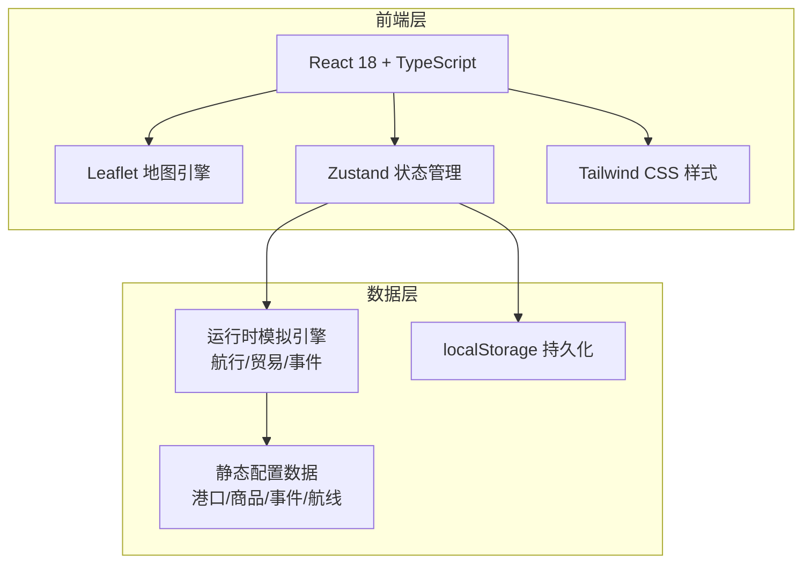
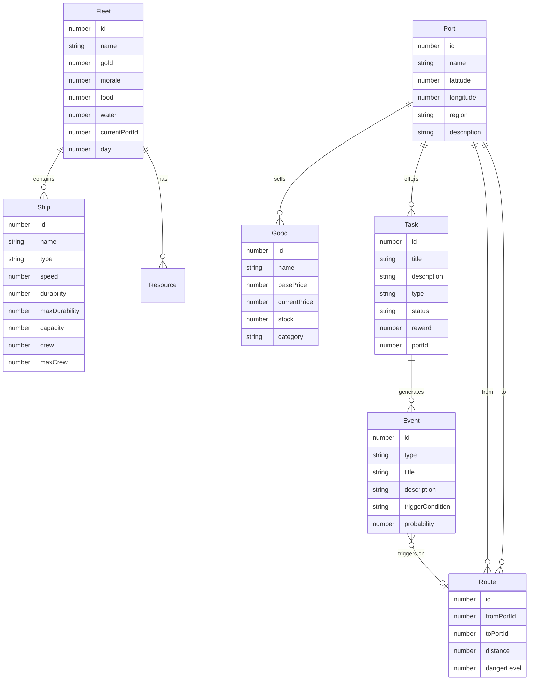

## 1. 架构设计



## 2. 技术说明
- 前端框架：React 18 + TypeScript + Vite
- 地图引擎：Leaflet + 自定义古风瓦片图层
- 样式方案：Tailwind CSS + CSS Variables 主题系统
- 状态管理：Zustand（轻量、无样板代码）
- 动画库：CSS Animations + GSAP（用于复杂航线动画）
- 持久化：localStorage（存档/读档）
- 初始化工具：vite-init
- 后端：无（纯前端，MVP阶段不需要后端服务）

## 3. 路由定义
| 路由 | 用途 |
|------|------|
| / | 主地图页面，包含所有核心交互 |
| /harbor/:id | 港口详情页（作为地图上的弹窗覆盖层） |

## 4. 数据模型

### 4.1 数据模型定义



### 4.2 数据定义

```typescript
interface Fleet {
  id: number
  name: string
  gold: number
  morale: number
  food: number
  water: number
  currentPortId: number | null
  isSailing: boolean
  day: number
  ships: Ship[]
}

interface Ship {
  id: number
  name: string
  type: 'caravel' | 'galleon' | 'sloop' | 'frigate'
  speed: number
  durability: number
  maxDurability: number
  capacity: number
  usedCapacity: number
  crew: number
  maxCrew: number
}

interface Port {
  id: number
  name: string
  nameCn: string
  latitude: number
  longitude: number
  region: 'caribbean' | 'europe' | 'africa' | 'asia'
  description: string
  services: ('repair' | 'supply' | 'recruit' | 'trade')[]
}

interface Good {
  id: number
  name: string
  nameCn: string
  basePrice: number
  category: 'food' | 'luxury' | 'material' | 'weapon' | 'spice'
}

interface PortGood {
  portId: number
  goodId: number
  price: number
  stock: number
  priceModifier: number
}

interface Route {
  id: number
  fromPortId: number
  toPortId: number
  distance: number
  dangerLevel: 1 | 2 | 3 | 4 | 5
  windFavor: number
}

interface GameEvent {
  id: number
  type: 'storm' | 'pirate' | 'disease' | 'accident' | 'discovery' | 'historical'
  title: string
  description: string
  triggerCondition: {
    minDay?: number
    region?: string
    dangerLevelMin?: number
    probability: number
  }
  choices: EventChoice[]
}

interface EventChoice {
  text: string
  outcomes: EventOutcome[]
}

interface EventOutcome {
  probability: number
  goldChange: number
  foodChange: number
  waterChange: number
  moraleChange: number
  durabilityChange: number
  crewChange: number
  description: string
  historicalNote?: string
}

interface Task {
  id: number
  title: string
  description: string
  type: 'main' | 'trade' | 'escort' | 'treasure' | 'rescue'
  status: 'available' | 'active' | 'completed' | 'failed'
  reward: { gold: number; fame?: number }
  portId: number
  targetPortId?: number
  requiredGoods?: { goodId: number; quantity: number }[]
}

interface GameState {
  fleet: Fleet
  currentRoute: Route | null
  routeProgress: number
  completedTasks: number[]
  activeTasks: Task[]
  eventLog: { event: GameEvent; choice: number; outcome: EventOutcome; day: number }[]
  discoveredPorts: number[]
}
```

## 5. 项目目录结构

```
src/
  components/
    map/
      MapView.tsx
      PortMarker.tsx
      RouteLine.tsx
      ShipAnimation.tsx
      WindOverlay.tsx
      CurrentOverlay.tsx
      PirateZoneOverlay.tsx
    panels/
      FleetPanel.tsx
      PortDetail.tsx
      EventLog.tsx
      TaskPanel.tsx
      TradePanel.tsx
    events/
      EventCard.tsx
      EventChoice.tsx
      EventResult.tsx
    ui/
      BottomBar.tsx
      Compass.tsx
      ResourceBar.tsx
      ParchmentCard.tsx
      ActionButton.tsx
  data/
    ports.ts
    goods.ts
    events.ts
    routes.ts
    ships.ts
    tasks.ts
  store/
    useGameStore.ts
    useMapStore.ts
  utils/
    navigation.ts
    trade.ts
    eventEngine.ts
    historyNotes.ts
  types/
    index.ts
  pages/
    MainMap.tsx
  App.tsx
  main.tsx
  index.css
```

## 6. 关键技术决策

### 6.1 地图引擎选择：Leaflet
- 选择Leaflet而非Mapbox：无需API Key，完全免费，社区生态丰富
- 使用自定义瓦片图层或Canvas叠加实现古风海图效果
- 通过Leaflet的DivIcon实现自定义港口标记和船只图标

### 6.2 状态管理：Zustand
- 轻量级，无样板代码，适合游戏状态管理
- 单一Store管理所有游戏状态，便于存档/读档
- 支持中间件（persist用于localStorage持久化）

### 6.3 事件引擎设计
- 基于概率+条件的触发系统
- 每次时间推进时检查所有事件的触发条件
- 事件结果通过加权随机选择
- 支持决策分支，不同选择导致不同结果

### 6.4 航行模拟
- 基于距离+风向+洋流计算航行天数
- 每日消耗食物和淡水
- 每日检查事件触发
- 到达港口时重置航行状态

### 6.5 贸易系统
- 每个港口有独立的商品价格表
- 价格基于基础价格+港口修正+随机波动
- 买卖影响库存和价格
- 利润 = 卖出价 - 买入价，受距离和稀缺性影响
